<div align="center">
  
</div>

<p align="center">
  <b>English</b> · <a href="README_TR.md">Türkçe</a>
</p>

<div align="center">
  
</div>

```console
mustafa@safialajati:~$ whoami
Software developer building practical systems across automation, data, web, AI-assisted development, and games.
```

### `01 // About`

I build software around real operational needs — not just isolated demos. My work combines **software development, business automation, data analysis, e-commerce workflows, AI-assisted development, and game systems**.

- Build internal tools that simplify repetitive business processes
- Develop role-based web applications and operational systems
- Work with Python for analytics, machine learning, and decision support
- Build gameplay systems and behavior-based AI with Godot 4
- Use AI-assisted development tools to accelerate implementation and iteration
- Approach projects from both a technical and business-oriented perspective

### `02 // Build Matrix`

<div align="center">
  
</div>

<br/>

| Area | Tools & technologies |
|:---|:---|
| **Application development** | Python, Java, C#, JavaScript, React, Node.js, Express, HTML, CSS, Tailwind CSS, SQL |
| **Data & ML** | Pandas, NumPy, Matplotlib, Scikit-learn, Streamlit |
| **Game development** | Godot 4, GDScript, Gameplay Programming, Game AI |
| **AI-assisted development** | OpenAI Codex, AI-Assisted Coding, Workflow Automation |
| **Business technology** | Business Automation, E-commerce Systems, Reporting, Process Improvement |

### `03 // Selected Work`

| Project | Signal |
|:---|:---|
| 🚧 **Paradox Protocol** | Upcoming multiplayer game in development, focused on teamwork, player interaction, and unpredictable sessions — core mechanics intentionally kept private for now |
| 👥 **[Employee Attendance Management System](https://github.com/safialajati2-creator/employee-attendance-management-system)** | Role-based Node.js system for attendance, working hours, overtime, late arrivals, shifts, reporting, audit logs, and backup/restore workflows |
| 🎮 **[THE SHADOW](https://github.com/safialajati2-creator/the-shadow-game)** | Playable Godot 4 dark-fantasy action platformer with combat, progression, save systems, enemy AI, and an adaptive boss encounter |
| 📊 **[Foreign Trade Decision Support System](https://github.com/safialajati2-creator/foreign-trade-decision-support-system)** | Python + Streamlit analytics application with data cleaning, economic indicators, forecasting, decision support, and PDF reporting |
| 💼 **[FreelanceHub](https://github.com/safialajati2-creator/freelancehub)** | Two-sided React marketplace frontend with role-based client/freelancer workflows, project management, messaging, proposals, and simulated payments |

<div align="center">
  <a href="https://github.com/safialajati2-creator?tab=repositories">
    
  </a>
</div>

### `04 // Engineering Signal`

| Focus | What I build with it |
|:---|:---|
| **Business automation** | Internal systems, operational workflows, reporting, role-based access, and process improvement |
| **Web applications** | React interfaces, Node.js/Express services, role-based workflows, and marketplace experiences |
| **Data-driven systems** | Analytics, machine learning, forecasting, visualization, and decision-support applications |
| **Game systems** | Gameplay mechanics, state management, save systems, enemy behavior, and adaptive game AI |
| **AI-assisted workflows** | Faster prototyping, coding, automation, iteration, and practical problem solving |

### `05 // Current Direction`

```text
BUILDING   → practical software with measurable value
EXPLORING  → multiplayer gameplay systems and stronger software architecture
IMPROVING  → testing, deployment, code quality, and production-ready workflows
```

### `06 // Connect`

<div align="center">
  <a href="https://github.com/safialajati2-creator">
    
  </a>
  <a href="https://www.linkedin.com/in/mustafa-alajati-8a1aa4286/?isSelfProfile=true">
    
  </a>
  <a href="mailto:Safialajati2@gmail.com">
    
  </a>
</div>

<div align="center">
  <sub><code>build(); automate(); improve(); repeat();</code></sub>
</div>
