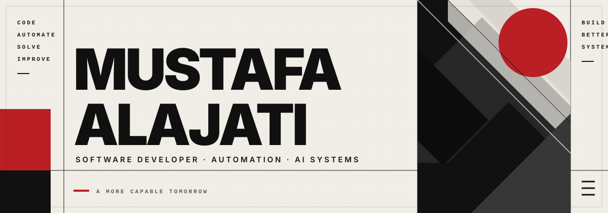

<div align="center">
  
</div>

<p align="center">
  <a href="README.md">English</a> · <b>Türkçe</b>
</p>

<div align="center">
  
</div>

```console
mustafa@safialajati:~$ whoami
Otomasyon, veri, web, AI destekli geliştirme ve oyun alanlarında pratik sistemler geliştiren Software Developer.
```

### `01 // Hakkımda`

Gerçek operasyonel ihtiyaçlara yönelik yazılımlar geliştiriyorum; yalnızca demo niteliğinde projeler üretmek yerine **yazılım geliştirme, iş otomasyonu, veri analizi, e-ticaret süreçleri, AI destekli geliştirme ve oyun sistemlerini** bir araya getiriyorum.

- Tekrarlayan iş süreçlerini azaltan iç sistemler ve otomasyonlar geliştiriyorum
- Rol tabanlı web uygulamaları ve operasyonel sistemler oluşturuyorum
- Python ile veri analizi, machine learning ve karar destek sistemleri geliştiriyorum
- Godot 4 ile gameplay sistemleri ve davranış tabanlı game AI üzerinde çalışıyorum
- AI destekli geliştirme araçlarını uygulama ve iterasyon süreçlerini hızlandırmak için kullanıyorum
- Projelere hem teknik hem de iş odaklı bir perspektiften yaklaşıyorum

### `02 // Build Matrix`

<div align="center">
  
</div>

<br/>

| Alan | Teknolojiler ve araçlar |
|:---|:---|
| **Uygulama geliştirme** | Python, Java, C#, JavaScript, React, Node.js, Express, HTML, CSS, Tailwind CSS, SQL |
| **Veri & ML** | Pandas, NumPy, Matplotlib, Scikit-learn, Streamlit |
| **Oyun geliştirme** | Godot 4, GDScript, Gameplay Programming, Game AI |
| **AI destekli geliştirme** | OpenAI Codex, AI-Assisted Coding, Workflow Automation |
| **İş teknolojileri** | Business Automation, E-commerce Systems, Reporting, Process Improvement |

### `03 // Seçili Projeler`

| Proje | Öne çıkan yönü |
|:---|:---|
| 🚧 **Paradox Protocol** | Takım çalışması, oyuncu etkileşimi ve öngörülemeyen multiplayer deneyimlere odaklanan geliştirme aşamasındaki oyun projesi — temel mekanikler şimdilik bilinçli olarak gizli tutuluyor |
| 👥 **[Employee Attendance Management System](https://github.com/safialajati2-creator/employee-attendance-management-system)** | Devam takibi, çalışma saatleri, mesai, gecikme, vardiya, raporlama, audit log ve yedekleme süreçlerini yöneten rol tabanlı Node.js sistemi |
| 🎮 **[THE SHADOW](https://github.com/safialajati2-creator/the-shadow-game)** | Combat, progression, save sistemleri, düşman AI'ı ve adaptif boss karşılaşması içeren oynanabilir Godot 4 dark-fantasy action platformer |
| 📊 **[Foreign Trade Decision Support System](https://github.com/safialajati2-creator/foreign-trade-decision-support-system)** | Veri temizleme, ekonomik göstergeler, tahmin modelleri, karar desteği ve PDF raporlama içeren Python + Streamlit analitik uygulaması |
| 💼 **[FreelanceHub](https://github.com/safialajati2-creator/freelancehub)** | Müşteri/freelancer rol akışları, proje yönetimi, mesajlaşma, teklifler ve simüle edilmiş ödemeler içeren iki taraflı React marketplace frontend'i |

<div align="center">
  <a href="https://github.com/safialajati2-creator?tab=repositories">
    
  </a>
</div>

### `04 // Engineering Signal`

| Odak | Bu alanda geliştirdiklerim |
|:---|:---|
| **İş otomasyonu** | İç sistemler, operasyonel akışlar, raporlama, rol tabanlı erişim ve süreç iyileştirme |
| **Web uygulamaları** | React arayüzleri, Node.js/Express servisleri, rol tabanlı süreçler ve marketplace deneyimleri |
| **Veri odaklı sistemler** | Analiz, machine learning, tahmin, görselleştirme ve karar destek uygulamaları |
| **Oyun sistemleri** | Gameplay mekanikleri, state management, save sistemleri, düşman davranışları ve adaptif game AI |
| **AI destekli iş akışları** | Daha hızlı prototipleme, kodlama, otomasyon, iterasyon ve pratik problem çözme |

### `05 // Güncel Yönelim`

```text
GELİŞTİRİYORUM → ölçülebilir değer üreten pratik yazılımlar
KEŞFEDİYORUM   → multiplayer gameplay sistemleri ve daha güçlü yazılım mimarileri
İYİLEŞTİRİYORUM→ test, deployment, code quality ve production-ready süreçler
```

### `06 // İletişim`

<div align="center">
  <a href="https://github.com/safialajati2-creator">
    
  </a>
  <a href="https://www.linkedin.com/in/mustafa-alajati-8a1aa4286/?isSelfProfile=true">
    
  </a>
  <a href="mailto:Safialajati2@gmail.com">
    
  </a>
</div>

<div align="center">
  <sub><code>build(); automate(); improve(); repeat();</code></sub>
</div>
